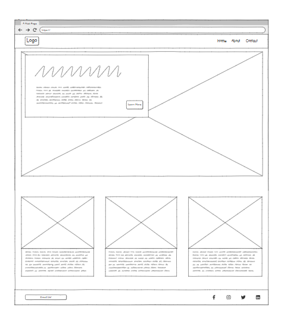
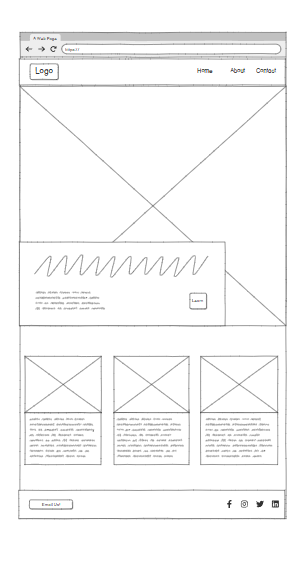

# Phishing-Safe

## Overview
Phishing-Safe is a website designed to educate students and employees on the essentials of phishing awareness and protecting sensitive information online. Phishing-Safe aims to foster a safer online environment by providing users with the knowledge needed to identify and respond to phishing attempts effectively.

## Target Audience
Phishing-Safe is designed for students, employees, and any individuals whose work is fundamentally based online. The site offers clear guidelines for recognizing phishing attempts and securing sensitive information, making it a valuable resource for anyone aiming to enhance their cybersecurity awareness in a digital-focused environment.

!
[alt text](image-2.png)

Initital wireframes of my project that I initially built didn't end up becoming my current project lay-out but provided a sense of where I wanted to take my initial html project.

When building my beginning project setup

I went with the roboto font as it gave my project a professional look.
My first idea was to have a looped video which related to the main message of my video.

https://www.youtube.com/watch?v=sS3mZVCARZg&pp=ygUScGhpc2hpbmcgYW5pbWF0aW9u

As we have built video containers before on the HTML Lms. I had used previous knowledge to implement that into the hero of my project. 

I liked the idea of a looped, muted animation that provided a visual message, which complimented the main purpose of the website which is to warn users about phishing.

Styling the video and using chatgpt to assist me, introduced me to the subtle but power styling effect of border-radius: ; which gives the feel of high quality ui, you will see that I consistently implemented around my project. 

I added a hover effect to the navigation links, making the links change color slightly when hovered to enhance interactivity.

The navigation bar is fixed at the top to remain visible as users scroll through the site, providing easy access to all sections.
## Responsive Layout
I used CSS media queries to ensure that each element is responsive, allowing Phishing-Safe to look polished on both mobile and desktop devices. Font sizes, padding, and card layouts adjust automatically to fit different screen sizes, enhancing readability and usability.

## Information Cards Section
The information cards section is designed with a flexible grid layout, which adjusts the number of cards per row based on screen width. This allows the cards to appear well-spaced and readable on both mobile and larger screens.
Each card includes a heading and a brief description, providing concise information on various aspects of phishing awareness. This modular design also makes it easy to add or rearrange content as needed. 

## Resources Section

The Resources section offers links to external guides, best practices, and reporting information, all organized within responsive cards for a consistent look.
Bootstrap’s grid system was leveraged to create a responsive three-column layout, which adjusts to a single-column layout on smaller screens, improving accessibility.
For anyone working on a similar project, here are some resources that guided the development of Phishing-Safe:

## Chatgpt & Copilot played a huge part in this development.

## https://www.w3schools.com/html/html_css.asp
HTML & CSS Basics: W3Schools HTML and CSS - This is a comprehensive resource for learning HTML, CSS, and various web development basics.

## https://developer.mozilla.org/en-US/docs/Glossary/Responsive_web_design
Responsive Web Design: MDN Web Docs - Responsive Design - A helpful guide on using media queries and flexible layouts to create responsive web pages.

## https://getbootstrap.com/
Bootstrap Documentation: Bootstrap 4 - Bootstrap’s grid system and components helped structure the layout and provided consistent styling.

## https://css-tricks.com/snippets/jquery/smooth-scrolling/
CSS Tricks - Smooth Scrolling: CSS Tricks - Smooth Scrolling - This tutorial explains how to implement smooth scrolling in a user-friendly way.

## https://animate.style/
CSS Animations: Animate.css - An easy-to-use library for adding simple animations, ideal for hover and fade-in effects.